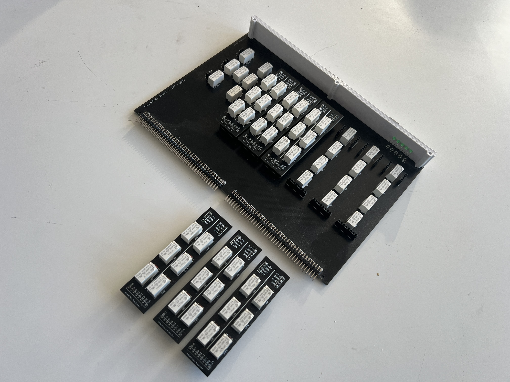
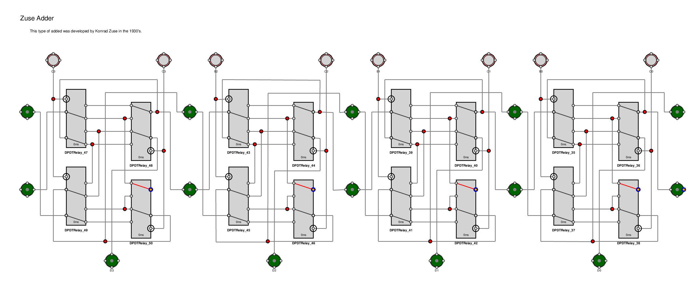
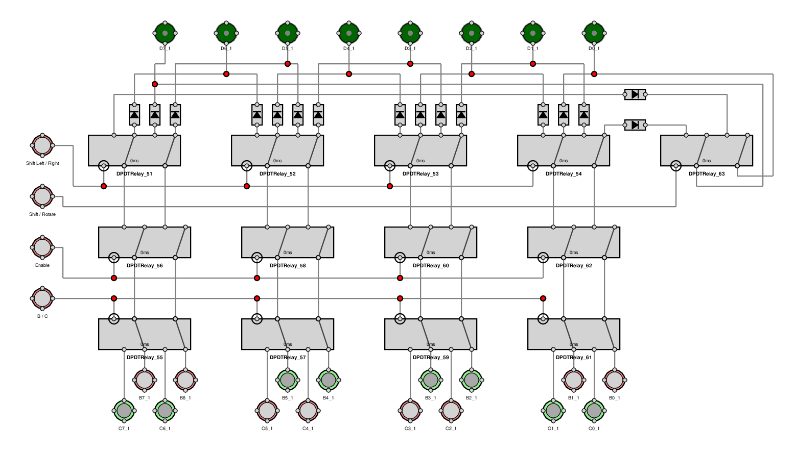

The ALU will eventually consist of a number of cards divided into three groups.

## ALU-L

There are 7 main logic gates. AND, OR, NOT, NAND, NOR, XOR and XNOR. For my relay computer I wanted to implement all of these.

The ALU-L cards provide all the logical functions. Rather than design separate cards for each set of logical functions, I realized it would be far easier (and cheeper) to have identical ALU_L main cards which control the gating and selection logic, with smaller daughter cards to support the actual logical functions.

Thefore my relay computer has two ALU_L cards, splitting all the logical functios between them.

Each card supports four logical functions each - via the daughter cards.

Card 1 supports AND, OR, XOR, NOT_B

Card 2 supports NOR, XNOR, NAND, NOT_C

Each daughter card supports two bits of data, D0 and D1, D2 and D3 etc. but they are all identical.

We only have to support 7 logical gates but I had enough capacity to add a NOT_B and a NOT_C. So I have 8 selectible logical functions over the two ALU_L cards.

In the photograph you can see the underneath the daughter cards are the gating relays that transfer the logical result to the data bus when required.

## ALU_A
This is the arithmetic card, It supports B + C, B - C, INCREMENT B and INCREMENT C.

This is probably the biggest card so far, so it has been split between a main card and a daughter board. The Main card holds the data latches and control logic, while the daughter card holds the full adder's.

I wan't to experiment with two different types of adder:

First a standard ripple adder.

The second will be a 'Zuse' adder. Developed by Konrad Zuse in the 1930's it's benefit is it is faster as it doesn't ripple across each adder.

My current design will be to have the input stages on the main card and the actual adder itself on a daughter card. I'm fairly confident around the support logic, but if If the adder unit itself needs additional iterations I can simply swap that section out.

## ALU_S
This is the Shift register card. It supports shifting or rotating left or right from Register B or Register C as the source.

Rotating left or right may never really be used, but for the cost of one relay it seemed a waste not to include the facility.
