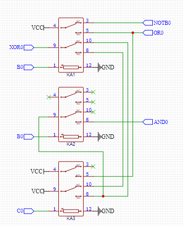
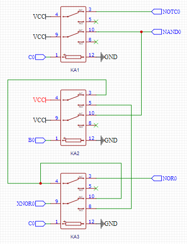
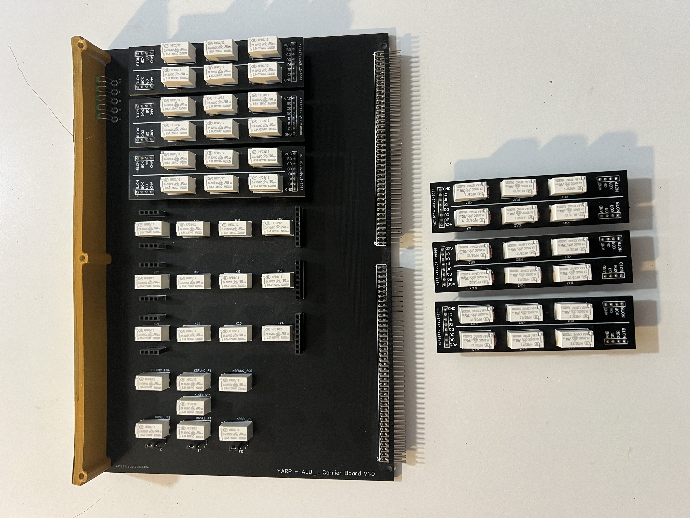

ALU_L Logic card demo.

 

https://youtu.be/VFxC7XhtL1E

The ALU_L Logic cards are much simpler then the ALU_A card. I have chosen to split these onto two cards, Each card will support 4 logical operations giving me a total of 8 logical operations.

These are:

Card 1 = AND, OR, XOR and NOT_B

Card 2 = NOR, XOR, NAND and NOT_C

After a careful bit of design I distilled these 8 logical functions down to two circuits each using 3 relays per bit.

Studying the schematics you can see that the B or C inputs are fed to the relay coils. Each circuit then generates the required logic states for that card. One of these is then gated onto the data bus if required.

Rather than designing and paying for two separate logic cards I decided to cheat a little. When I send a board off to be manufactuered the minimum quantity I can order is 5 boards. Rather than having 4 spares of each ALU_L design I created a generic ALU_L carrier card with gating and control logic. I then designed small daughter boards each with two bit's of logic to plug into them.

Each Daughter card is identical and deals with two bits of logic (D0 and D1 for example).

Here you can see the ALU_L Carrier board with three daughter boards removed. The gating relays sit underneath the daughter boards with the control logic relays to the left of the board.